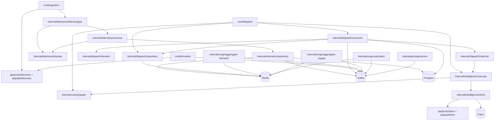
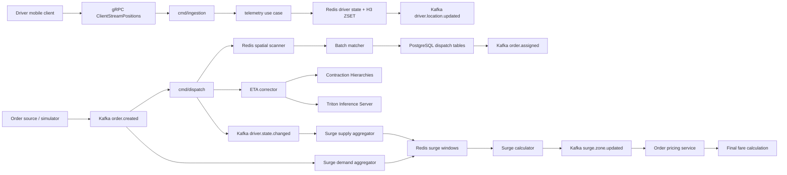

# Driver Delivery Platform Architecture Map

This document summarizes the current repository architecture from the code-review graph, package layout, and runtime entrypoints. It is meant to help the team orient quickly and understand how the system moves data from telemetry to pricing.

## Executive Summary

- The repo currently has two bootstrapped runtime services:
  - `cmd/ingestion` for driver telemetry ingestion.
  - `cmd/dispatch` for order matching and assignment.
- The system is event-driven:
  - driver telemetry updates flow into Redis and Kafka.
  - `order.created` feeds dispatch matching and surge demand tracking.
  - `driver.state.changed` feeds surge supply tracking.
  - `surge.zone.updated` feeds the pricing cache.
- ETA correction is layered:
  - baseline shortest-path routing comes from the CH graph package.
  - Triton can refine the ETA, but the CH route is the fallback.
- The code-review graph shows the strongest hubs are tests and entrypoints, which is a good sign that the repository is centered around pipeline behavior rather than a large amount of cross-package coupling.

## Community And Package Map

The table below maps the graph communities to the actual packages and their role in the platform.

| Graph community | Package / files | Role |
|---|---|---|
| `v1-telemetry`, `v1-location` | `pkg/api/telemetry/v1/*` | Generated gRPC and protobuf bindings for telemetry ingestion. |
| `ingestion-env` | `cmd/ingestion/main.go` | Service bootstrap for telemetry ingestion. Wires Postgres, Redis Cluster, Kafka, gRPC, and graceful shutdown. |
| `grpc-location` | `internal/telemetry/delivery/grpc` | Adapter from gRPC stream input to domain use case calls. |
| `domain-driver` | `internal/telemetry/domain` | Telemetry domain model and repository/use-case interfaces. |
| `usecase-telemetry` | `internal/telemetry/usecase` | Orchestrates H3 conversion, driver-metric enrichment, Redis writes, and Kafka fan-out. |
| `repository-redis`, `repository-driver`, `repository-kafka` | `internal/telemetry/repository` | Persistence adapters for Redis driver state, Postgres driver metrics, and Kafka telemetry publishing. |
| `consumer-order`, `domain-ordercreatedpayload` | `internal/dispatch/consumer`, `internal/dispatch/domain` | Kafka order consumer, batch windowing, assignment commit path, and order payload model. |
| `repository-spatial`, `repository-scan` | `internal/dispatch/repository` | Redis H3 k-ring lookup plus candidate driver hydration. |
| `matcher-match`, `matcher-evaluate` | `internal/dispatch/matcher` | Cost model, greedy wrapper, Hungarian batch solver, and assignment scoring. |
| `graph-contraction`, `graph-path` | `internal/routing/graph` | Baseline shortest-path ETA engine and its tests. |
| `aggregator-demand`, `aggregator-recent` | `internal/surge/aggregator/demand_aggregator.go` | Consumes `order.created` and maintains rolling demand windows in Redis. |
| `aggregator-supply`, `aggregator-available` | `internal/surge/aggregator/supply_aggregator.go` | Consumes `driver.state.changed` and maintains rolling supply windows in Redis. |
| `calculator-surge` | `internal/surge/calculator` | Computes surge multipliers from demand and supply and publishes `surge.zone.updated`. |
| `n/a` | `internal/intelligence/client` | Triton gRPC client used for ETA correction inference. |
| `n/a` | `internal/intelligence/usecase` | ETA correction use case with CH fallback and Triton augmentation. |
| `n/a` | `internal/pricing/service` | In-memory surge-matrix consumer and fare calculator. |
| `n/a` | `cmd/simulator/main.go` | Local E2E smoke harness that drives telemetry and order flow. |
| `n/a` | `test/integration`, `internal/test` | Live-infra integration tests and E2E pipeline tests. |

## Package Roles By Layer

### API Contracts

- `api/proto/telemetry/v1/telemetry.proto` defines `LocationIngestionService` and the driver location stream request/response messages.
- `api/proto/triton/triton.proto` defines the gRPC inference contract used by the ETA correction client.
- `pkg/api/telemetry/v1` and `pkg/api/triton` are generated code and should not be edited manually.

### Telemetry Ingestion

- `cmd/ingestion` is the runtime entrypoint.
- `internal/telemetry/delivery/grpc` accepts the gRPC client stream, converts protobuf data into the domain model, and forwards to the use case.
- `internal/telemetry/usecase` is the orchestration layer:
  - computes the H3 cell at resolution 8,
  - optionally enriches driver metrics from Postgres,
  - writes driver state to Redis,
  - publishes the async telemetry event to Kafka.
- `internal/telemetry/repository` contains the infrastructure adapters:
  - Redis driver-state repository,
  - Postgres driver-metrics reader,
  - Kafka producer for `driver.location.updated`.

### Dispatch And Matching

- `cmd/dispatch` is the runtime entrypoint for matching.
- `internal/dispatch/domain` carries the `OrderCreatedPayload` and the Kafka message context used for offset commits.
- `internal/dispatch/repository` reads the Redis H3 neighborhood and hydrates candidate driver metadata.
- `internal/dispatch/matcher` computes the assignment score:
  - ETA,
  - acceptance rate,
  - cancellation probability,
  - surge penalty,
  - idle-time bias.
- `internal/dispatch/consumer` does the end-to-end batch pipeline:
  - consumes `order.created`,
  - buffers by time or batch size,
  - executes greedy or Hungarian matching,
  - commits the order and driver state in Postgres,
  - emits `order.assigned`,
  - emits `driver.state.changed`.

### Routing And Intelligence

- `internal/routing/graph` is the deterministic baseline ETA engine. It uses a CH-style graph search and returns an ETA in seconds.
- `internal/intelligence/client` is the Triton inference client. It serializes feature tensors, calls `ModelInfer`, and returns a multiplier.
- `internal/intelligence/usecase` combines both layers:
  - compute CH ETA first,
  - call Triton if configured,
  - fall back to CH ETA if inference fails or is unavailable.

### Surge And Pricing

- `internal/surge/aggregator/demand_aggregator.go` consumes `order.created` and stores demand in Redis ZSET windows keyed by `surge:demand:{city}:{cell}`.
- `internal/surge/aggregator/supply_aggregator.go` consumes `driver.state.changed` and stores supply in Redis ZSET windows keyed by `surge:supply:{city}:{cell}`.
- `internal/surge/calculator` periodically reads both windows, computes the multiplier, caps it, and publishes `surge.zone.updated`.
- `internal/pricing/service` listens to `surge.zone.updated` and keeps an in-memory `{city}:{h3_cell}` multiplier cache for fare calculation.

## Compact Dependency Diagram

This diagram shows package-level dependencies, not deployment units. The only service entrypoints currently present are `cmd/ingestion`, `cmd/dispatch`, and `cmd/simulator`.

## Runtime Data Flow

## End-To-End Flow In Plain English

1. A driver client streams position updates to the ingestion service over gRPC.
2. The ingestion handler converts the request into `DriverLocation`.
3. The telemetry use case computes the H3 cell, enriches driver metrics if available, writes Redis state, and publishes `driver.location.updated`.
4. An order is created and published as `order.created`.
5. The dispatch consumer batches incoming orders for a short window.
6. For each order, dispatch scans Redis for nearby drivers and hydrates candidate metadata.
7. The matcher scores candidates and selects the best driver.
8. The assignment is committed in Postgres inside a transaction.
9. Dispatch emits `order.assigned` and `driver.state.changed`.
10. The surge demand aggregator tracks order volume per city/cell.
11. The surge supply aggregator tracks driver availability per city/cell.
12. The surge calculator combines demand and supply into a multiplier and publishes `surge.zone.updated`.
13. The pricing service consumes the surge update and caches the multiplier for fare calculation.

## What Is Live In This Checkout

- Live runtime entrypoints:
  - `cmd/ingestion`
  - `cmd/dispatch`
  - `cmd/simulator`
- Library-style subsystems present in the tree:
  - routing/ETA,
  - Triton integration,
  - surge aggregators,
  - surge calculator,
  - pricing cache consumer.
- There is no separate `cmd/*` bootstrap in this snapshot for the surge pipeline or pricing service, so those modules currently read as supporting packages rather than independently launched services.

## Test Coverage Notes

- The heaviest graph hubs are E2E and integration tests, which means the repository validates the pipeline end to end rather than only at unit level.
- Notable test areas:
  - telemetry ingestion handler and H3 conversion,
  - Redis driver-state updates and ghost-driver eviction,
  - spatial scanner candidate retrieval,
  - matching cost function and fallback behavior,
  - CH routing paths,
  - surge demand/supply window logic,
  - surge multiplier math,
  - pricing multiplier application.

## Infrastructure And Support Files

- `schema.sql` defines the PostgreSQL schema, triggers, and indexes.
- `docker-compose.yml` boots the local infra stack.
- `deploy/local/*` contains local K8s manifests and bootstrap scripts.
- `model_repository/xgboost_spatial_corrector/*` contains Triton model artifacts.
- `run_e2e_test.ps1` is the Windows orchestration script for E2E verification.
- `bin/*` contains prebuilt binaries and local run logs for convenience.

## Biggest Architectural Risks And Wiring Gaps

| Risk / gap | Why it matters | Suggested fix |
|---|---|---|
| Surge and pricing packages have no service entrypoint. | Demand aggregation, supply aggregation, surge calculation, and pricing sync exist as packages, but nothing in `cmd/*` starts them. In a local or deployed run, pricing will not update unless another process is added. | Add explicit `cmd/surge` and `cmd/pricing` services, or intentionally fold those loops into an existing service with clear ownership. |
| `driver.state.changed` producer and consumer schemas do not match. | Dispatch emits `driver_id`, `new_state`, and `changed_at`; the supply aggregator expects `driver_id`, `city_prefix`, `previous_state`, `current_state`, `h3_cell`, and `timestamp`. As written, supply aggregation cannot reliably update supply windows. | Define one shared event struct or protobuf schema and use it from both dispatch and surge aggregation. Include city and H3 cell in the emitted event. |
| Assignment updates Postgres but does not update Redis availability state. | Dispatch marks the driver `ONLINE_EN_ROUTE` in Postgres and emits Kafka, but the Redis spatial index/profile can still make the driver look available until TTL or another telemetry update changes state. | On assignment, remove or mark the driver in Redis as unavailable in the same operational path, or make spatial scanning filter by the Redis status key. |
| `driver.location.updated` is published but has no local consumer. | The topic exists and telemetry emits to it, but this checkout does not show a consumer for stale-driver detection, traffic probes, or surge supply updates. | Add the intended consumer or document the topic as integration output for an external service. |
| `order.assigned` is published but has no local consumer. | Assignment events are useful for notifications, order state machines, and analytics, but this repo only emits them. | Add/point to the downstream consumer, or mark it as an external integration contract. |
| Runtime CH graph is only a tiny seeded placeholder. | The architecture describes city-scale OSM/CH routing, but `cmd/dispatch` seeds only two nodes and two edges. ETA quality will be unrealistic outside tests or demos. | Add graph loading/preprocessing, or make the fallback behavior explicit in local/dev mode. |
| Matching launches one goroutine per order-driver cost cell. | Hungarian matrix construction can spawn up to `orders * drivers` goroutines. At the configured 150 order batch size, this can become a burst of thousands of goroutines and remote ETA calls. | Bound concurrency with a worker pool or semaphore and make the ETA cache/cost builder budget-aware. |
| Kafka offset strategy drops unmatched orders permanently. | The dispatch consumer advances offsets for starvation and no-valid-assignment cases. That prevents partition stalls, but also means orders are not retried later when supply appears. | Add a retry/dead-letter/requeue path with reason codes for unmatched orders. |
| Pricing service cache is process-local only. | `OrderPricingService` keeps surge multipliers in memory. Restarts lose the cache until Kafka replay catches up, and there is no shared read model for other services. | Persist latest surge multipliers in Redis/Postgres or use Kafka compaction with replay guarantees. |

## Summary

The platform is organized around dispatch as the core service. Telemetry writes state into Redis and Kafka, dispatch consumes order events and matches drivers, and the surge/pricing chain consumes the same event stream to derive fare multipliers. The routing and Triton layers sit behind dispatch as optional ETA refinement, not as the primary control plane.
